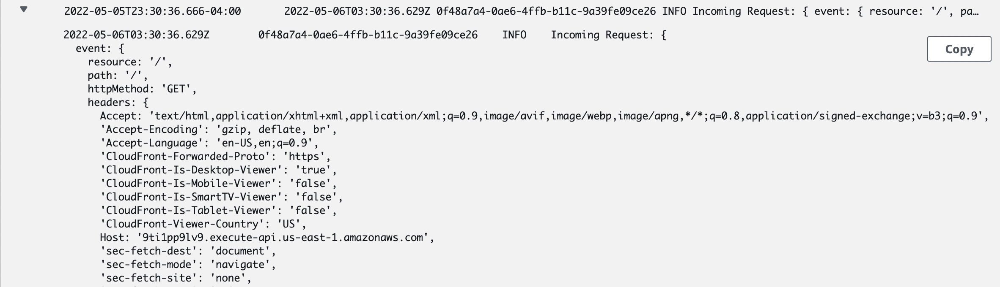
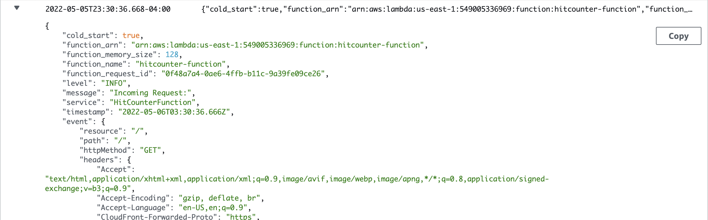
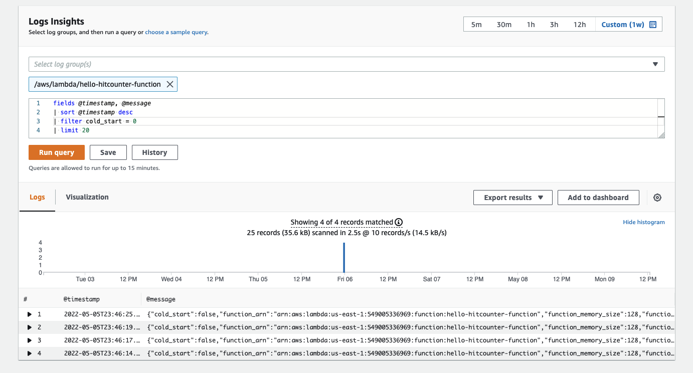
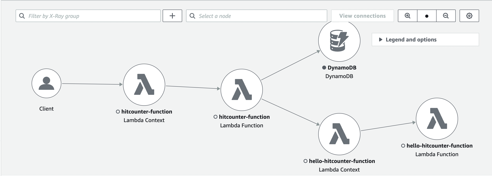
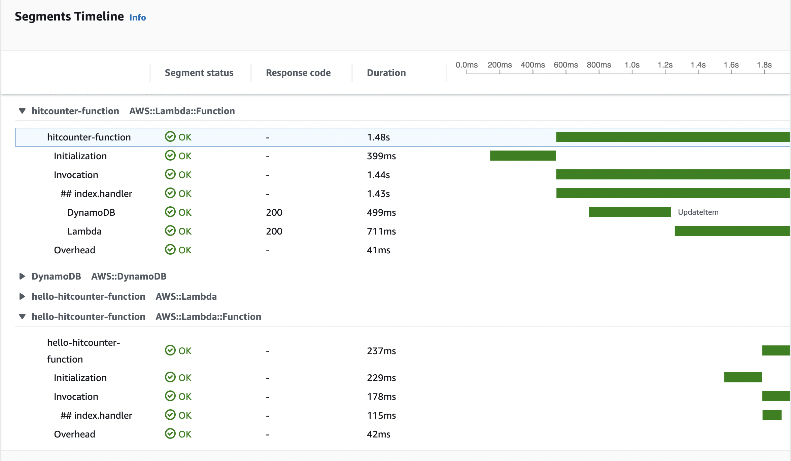
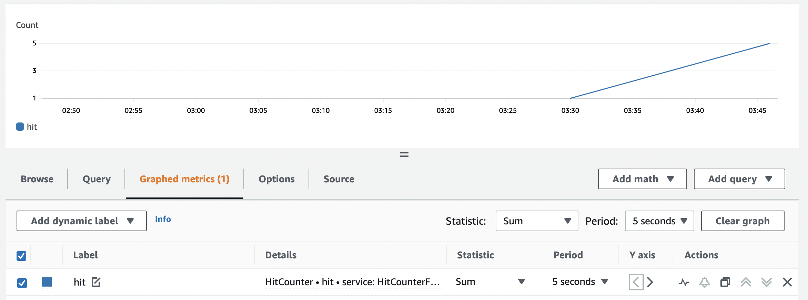

# AWS Lambda Powertools for TypeScript Examples

This example project has been taken from the [TypeScript CDK Workshop](https://cdkworkshop.com/20-typescript.html) and has been modified and integrated with [AWS Lambda Powertools for TypeScript](https://awslabs.github.io/aws-lambda-powertools-typescript/latest/) to show how an actual application might use the library.

**Note:** This example _only_ includes the core utilities Logger, Tracer, and Metrics which are the only utilities supported by AWS Lambda Powertools at the time of the making of this example.

If you aren't yet familiar with the AWS Cloud Development Kit (CDK), I highly recommend following along with that workshop! You won't need any CDK experience unless you want to deploy and test the application yourself. The main goal of these examples is to show the benefits of using AWS Lambda Powertools for TypeScript, and how easy it is to integrate into your existing Lambda functions.

AWS Lambda Powertools for TypeScript can be used in both TypeScript and JavaScript Lambda functions, so we have included examples for each.

## Directory structure

```plaintext
/bin          <-- Entrypoint of the CDK application (only needed if deploying with CDK)
/lib          <-- CDK application’s main stack and constructs (only needed if deploying with CDK)
/lambda
  /javascript <-- Example of using Lambda Powertools with JavaScript Lambda functions
  /typescript <-- Example of using Lambda Powertools with TypeScript Lambda functions
```

## Useful commands if using the CDK

- `npm run build` compile typescript to js
- `npm run watch` watch for changes and compile
- `npm run test` perform the jest unit tests
- `cdk deploy` deploy this stack to your default AWS account/region
- `cdk diff` compare deployed stack with current state
- `cdk synth` emits the synthesized CloudFormation template

## Lambda Powertools in action

Below are some quick snippets of each utility in action to show how easy it is to implement. For more exhaustive examples, check out the official [Documentation](https://awslabs.github.io/aws-lambda-powertools-typescript/latest/) and [Examples](https://github.com/awslabs/aws-lambda-powertools-typescript/tree/main/examples)

### Logger

TypeScript

```typescript
// import Logger and injectLambdaContext middleware to auto-capture and log the Lambda Context
import { Logger, injectLambdaContext } from '@aws-lambda-powertools/logger';
// import Middy
import middy from '@middy/core';
import { Context } from 'aws-lambda';

// create Powertools Logger instance with custom service name
const logger = new Logger({ serviceName: 'HitCounterFunction' });

const lambdaHandler = async (event: any, context: Context): Promise<unknown> => {
  // Old way of logging
  console.log('Incoming Request:', { event });
  // New way of logging using Powertools Logger
  logger.info('Incoming Request:', { event });

  ...
}

// Use middy to add middleware to the Lambda handler. Although not required, this is the simplest way to use Lambda Powertools.
// It cleans up the handler and removes the need to add boilerplate code, while also allowing you to add custom middleware if needed.
export const handler = middy(lambdaHandler).use(injectLambdaContext(logger));
```

JavaScript

```javascript
// import Logger and injectLambdaContext middleware to auto-capture and log the Lambda Context
const { Logger, injectLambdaContext } = require('@aws-lambda-powertools/logger');
// import Middy
const middy = require('@middy/core');

// create Powertools Logger instance with custom service name
const logger = new Logger({ serviceName: 'HitCounterFunction' });

const lambdaHandler = async function (event, context) {
  // Old way of logging
  console.log('Incoming Request:', { event });
  // New way of logging using Powertools Logger
  logger.info('Incoming Request:', { event });

  ...
}

// Use middy to add middleware to the Lambda handler. Although not required, this is the simplest way to use Lambda Powertools.
// It cleans up the handler and removes the need to add boilerplate code, while also allowing you to add custom middleware if needed.
const handler = middy(lambdaHandler).use(injectLambdaContext(logger));

module.exports = { handler };
```

Logs in CloudWatch when using `console.log()`. When you click `Copy`, you get a string representation of the entire log.



Structured logs in CloudWatch when using Lambda Powertools `logger.info()`. When you click `Copy`, you get a structured JSON object. This is makes searching logs super easy!



Query structured logs in CloudWatch Logs Insights.



### Tracer

**Note:** For Tracer, you can use a Decorator or [Middy](https://github.com/middyjs/middy). Middy is my preferred implementation because it's cleaner and also unlocks more functionality with the ability to now use custom or other open-source middleware.

TypeScript

```typescript
import { captureLambdaHandler, Tracer } from '@aws-lambda-powertools/tracer';
import { DynamoDBClient } from '@aws-sdk/client-dynamodb';
import { DynamoDBDocumentClient } from '@aws-sdk/lib-dynamodb';
import { LambdaClient } from '@aws-sdk/client-lambda';
import { Context } from 'aws-lambda';
import middy from '@middy/core';

// create Powertools Tracer instance
const tracer = new Tracer({ serviceName: 'HitCounterFunction' });

// create AWS SDK clients with Powertools Tracer instrumentation to automatically capture traces
const dynamoDBClient = tracer.captureAWSv3Client(new DynamoDBClient({}));
const dynamoDBDocumentClient = DynamoDBDocumentClient.from(dynamoDBClient);
const lambdaClient = tracer.captureAWSv3Client(new LambdaClient({}));

const lambdaHandler = async (event: any, context: Context): Promise<unknown> => {
  // Optionally add custom annotation for filtering traces
  tracer.putAnnotation('awsRequestId', context.awsRequestId);
  // Optionally add custom metadata for traces
  tracer.putMetadata('eventPayload', event);

  ...
}

// Use middy to add middleware to the Lambda handler. Although not required, this is the simplest way to use Lambda Powertools.
// It cleans up the handler and removes the need to add boilerplate code, while also allowing you to add custom middleware if needed.
export const handler = middy(lambdaHandler).use(captureLambdaHandler(tracer));
```

JavaScript

```javascript
const { Tracer, captureLambdaHandler } = require('@aws-lambda-powertools/tracer');
const middy = require('@middy/core');
const { DynamoDB, Lambda } = require('aws-sdk');

// create Powertools Logger instance
const logger = new Logger({ serviceName: 'HitCounterFunction' });

// create Powertools Tracer instance
const tracer = new Tracer({ serviceName: 'HitCounterFunction' });

// create AWS SDK clients with Powertools Tracer instrumentation to automatically capture traces
const dynamo = tracer.captureAWSClient(new DynamoDB());
const lambda = tracer.captureAWSClient(new Lambda());

const lambdaHandler = async function (event, context) {
  // Optionally add custom annotation for filtering traces
  tracer.putAnnotation('awsRequestId', context.awsRequestId);
  // Optionally add custom metadata for traces
  tracer.putMetadata('eventPayload', event);

  ...
}

// Use middy to add middleware to the Lambda handler. Although not required, this is the simplest way to use Lambda Powertools.
// It cleans up the handler and removes the need to add boilerplate code, while also allowing you to add custom middleware if needed.
const handler = middy(lambdaHandler).use(captureLambdaHandler(tracer));

module.exports = { handler };
```

Service Map of the entire application when instrumented with Tracer.



Traces with additional subsegments in each function when you instrument the tracer with AWS or HTTP(s) clients.



### Metrics

TypeScript

```typescript
import { Metrics, MetricUnits, logMetrics } from '@aws-lambda-powertools/metrics';
import middy from '@middy/core';
import { Context } from 'aws-lambda';

// create Powertools Metrics instance
const metrics = new Metrics({ namespace: 'HitCounter', serviceName: 'HitCounterFunction' });

const lambdaHandler = async (event: any, context: Context): Promise<unknown> => {
  // Optionally create a custom metric
  metrics.addMetric('hit', MetricUnits.Count, 1);
  metrics.publishStoredMetrics();

  ...
```

JavaScript

```javascript
const { Metrics, MetricUnits, logMetrics } = require('@aws-lambda-powertools/metrics');
const middy = require('@middy/core');

// create Powertools Metrics instance
const metrics = new Metrics({ namespace: 'HitCounter', serviceName: 'HitCounterFunction' });

const lambdaHandler = async function (event, context) {
  // Optionally create a custom metric
  metrics.addMetric('hit', MetricUnits.Count, 1);
  metrics.publishStoredMetrics();

  ...
```

Custom metrics show up CloudWatch allowing you to create graphs have them update automatically.


